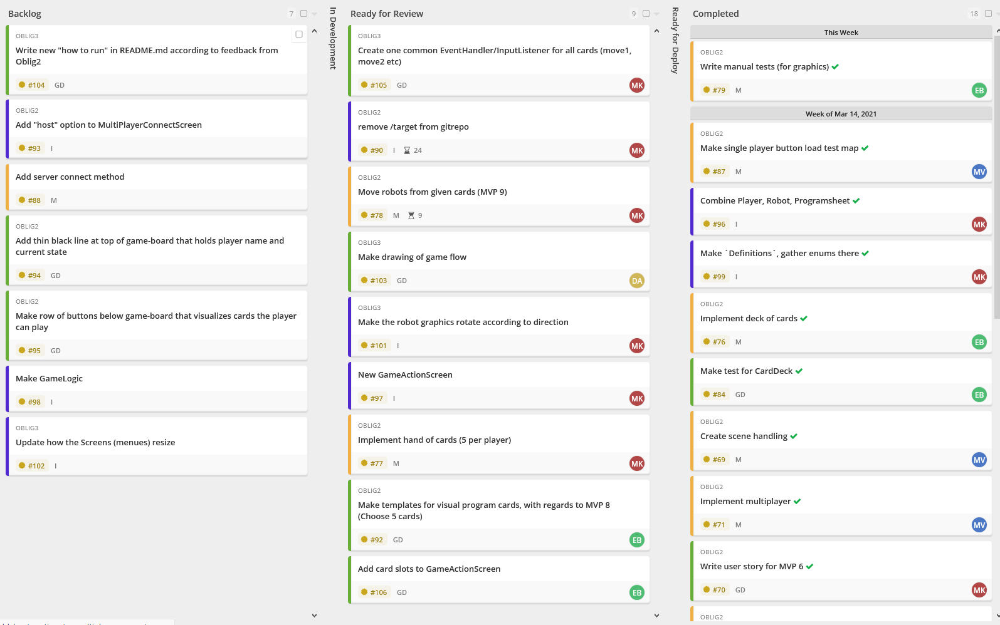

# Mandatory Assignment 3

## Subproblem 1: Team and project

### Project board screen shot

### Links to minutes of meeting since last time

## Subproblem 2: Requirements

## Subproblem 3: Product delivery and code quality

### Explanation of difference in number of commits
At first glance there is a big difference in the number of commits between the team members.
If one also looks at the number of lines changed, the difference is a lot less.

#### The main reasons for this are:
- Morten and Daniel have written most of the MOMs and other text files, this gives more commits
- Edyta and Mathias has written bigger chunks of code that has been waiting for earlier code to be finished,
  and their big changes were commited at once, giving fewer commits.
- Morten has refactored several files, changed data type for a lot of field variables and has removed
  unused code. Each file should have a separate commit, giving more commits
- Morten has "hosted" pair programming sessions, giving more commits

Overall, everybody has contributed as evenly to the project as could be expected.

By looking at the number of lines added, removed and the number of commits, the picture is more even.
as seen
in the below screenshots (at the time of writing, Mathias' big change is not commited/merged). 
#### Commits

#### Additions

#### Deletions

[Click here for live commit statistics](https://github.com/inf112-v21/Fantastic-Four/graphs/contributors)