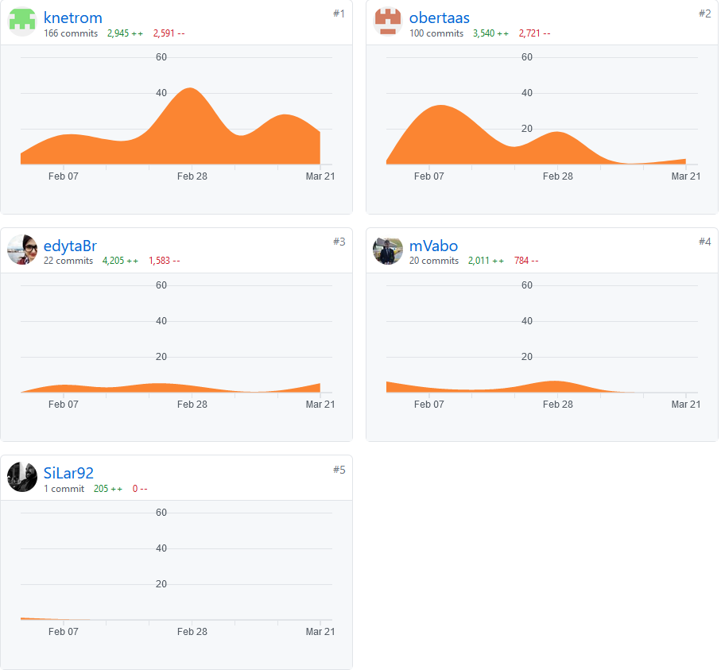
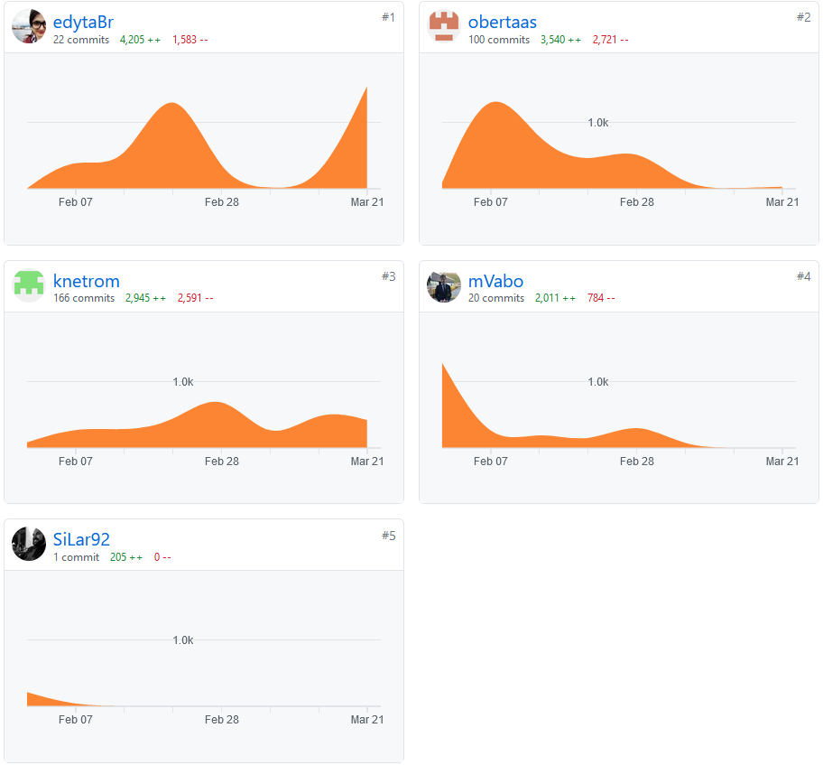
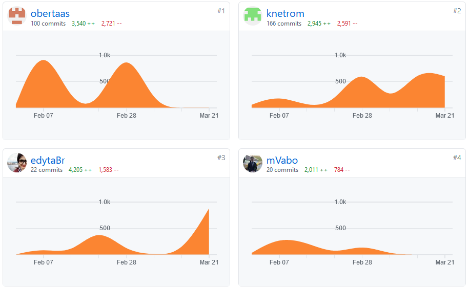

# Mandatory Assignment 3

Er det noen erfaringer enten team-messig eller mtp prosjektmetodikk som er verdt å nevne? Synes teamet at de valgene
dere har tatt er gode? Hvis ikke, hva kan dere gjøre annerledes for å forbedre måten teamet fungerer på?

## Subproblem 1: Team and project

- The team roles work good, they have solidified over the past weeks of working together
-
- Retrospect:
  - We wanted to do improve on what we discussed in last delivery's retrospect, so we had a physical meeting early on
    such that every team member got a common view and understanding of how the different parts of the project and codes
    would be combined into a working RoboRally game
  - We experienced that we gained a lot from meting physically; we all got a clearer overview of the architecture of
    the project, and we even made some important adjustments in our code that made it easier for us to carry out the
    teamwork ahead
  - however, pandemic restrictions made it so that we were only able to meet up once
- Improvements for next time:
  - If possible, we would like to physically meet up at least once for the next sprint of the project, as we saw that
    this helped us immensely
  - 
- The prioritized tasks for the next sprint are:
  - making the multiplayer part of the game work (focus on the classes RoboRallyClient
  and RoboRallyServer)
  - implementing the game loop into the RoboGame class
  - creating a GameLogic class for taking care of the rules of the game and the logic behind movements etc.
- The group dynamic works good, probably as a result of the natural division of tasks among the team members
- Communication is good, as we all try to respect the others work, and the fact that we have different technical
  approaches when it comes to programming

### Links to minutes of meeting since last time

Husk å skrive hvilke bugs som finnes i de kravene dere har utført (dersom det finnes bugs).

## Subproblem 2: Requirements
Last time our focus was on MVP's 6 through 9, and we finished those with a preliminary back-end solution involving
terminal/console prints of game movements/events. This time we wanted to complete these MVP's with the GUI approach in
mind. Below are all user stories, requirements and proposed solutions that we ended up using (MVP7, MVP8 and MVP9) for 
singleplayer only. Last time we focused on the multiplayer bit as well (MVP 6), but we have decided to make an effort
first and foremost on finishing the singleplayer part of the game. This is because we expect the multiplayer
implementation to go more smoothly once we have completed the singleplayer logic. Parts of the specifications are
similar to the ones delivered in ObligatoriskOppgave2.md, but we tried to make it shorter and sweeter and to the point.

- MVP7 (Deal cards to players): implemented for singleplayer; cards are now shown in the GUI. In reality this mvp was
  implemented last sprint (back-end), and the most important thing missing was the visualisation in the GUI.
- MVP8 (Each player to choose 5 cards): implemented for singleplayer; cards are selected and shown in the GUI.
- MVP9 (Move robot by selected program cards): implemented for singleplayer; robot moves automatically based on the
  selected program cards (verified visually through the GUI)

### MVP 7: Deal cards to players
#### Assumptions:

#### User stories:
- As a player, when it is my turn, I want to receive as many cards as the rules allow (upto 9), to be able to pick as
  many cards as the rules allow
- As a player, I want to  (in the GUI) what properties cards have when I can pick them up, to be able to plan my strategy
- As a player, I want the roboGame to hand out cards, so that I get a hand of cards to pick moves from

#### Acceptance criteria:
- Given a `Deck` object containing `Card`s, when the deal method is called, then each `Player` receives an randomly
  selected `Deck` of `Card`s from the original `Deck`
- Given a `Deck` object containing `Card`s, when the deal method is called, then each `Player` can get obtain
  information about what type of cards are they, how high priority they have.
- Given a `Deck` of `Card`s, when a `Card` is dealt from the `Deck`, then that `Card` is removed from the `Deck`

#### Work tasks:
- Decide on the representation of cards and decks
- According to the `AbstractCard` create subclasses to extend and implement/override the abstract methods.
- Implement `AbstractDeck`
- According to the `AbstractDeck` create subclasses to extend and implement/override the abstract methods.
- Write tests

### MVP 8: Each player to choose 5 cards
#### Assumptions:
- The correct amount of `Card`s are dealt (9)

#### User stories:
- As a player, I want to select, (through the GUI) 5 cards from the 9 cards I am dealt to be able to create a set of moves
- As a player, I want the card I select from the 9 cards to be unavailable (in the GUI) when I select the next card, to avoid
  breaking the rules

#### Acceptance criteria:
- Given a player has has received `n` cards,
  when the player picks 1 of the `n` cards,
  then only `n-1` cards are available for picking next
- Given a player that has received `n` cards
  and picked 4 cards,
  when the players picks card number 5,
  then the player cannot pick any more cards
  
#### Work tasks:
- Implement a `Deck` for each `Player`
- Allow the player to select `m` cards from a dealt `Deck` of `n` cards

### MVP 9: Move robot by selected program cards

#### User stories:
- As a user, I want my robot to move according to my selected cards, to abide by the RoboGame rules
- As a user, I want all robots to move according to their selected cards, to ensure RoboGame progress

#### Acceptance criteria:
- Given a turn of the RoboGame,
  when it is the turn of the first `Player`'s robot,
  then that robot moves according to that `Player`'s `Card` corresponding to that turn
- Given a turn of the RoboGame,
  when it is the turn of a `Player`'s robot
  and the next `Card` in that `Player`'s program register is `Move n` (`1 <= n <= 3`)
  then the `Player`'s robot moves `n` step in the direction that the robot is facing
- Given a turn of the RoboGame,
  when it is the turn of a `Player`'s robot
  and the next `Card` in that `Player`'s program register is `Rotate left`
  then the `Player`'s robot rotates 90° counter clockwise from the direction that the robot is facing
- Given a turn of the RoboGame,
  when it is the turn of a `Player`'s robot
  and the next `Card` in that `Player`'s program register is `Rotate right`
  then the `Player`'s robot rotates 90° clockwise from the direction that the robot is facing
- Given a turn of the RoboGame,
  when it is the turn of a `Player`'s robot
  and the next `Card` in that `Player`'s program register is `U-turn`
  then the `Player`'s robot rotates 180° clockwise from the direction that the robot is facing
- Given a turn of the RoboGame,
  when it is the turn of a `Player`'s robot
  and the next `Card` in that `Player`'s program register is `Back up`
  then the `Player`'s robot is moved 1 step in the opposite direction that the robot is facing

#### Work tasks:
- Implement a RoboGame loop with one turn (five phases), that show the movement of the robot in the GUI

Deloppgave 3: Produktleveranse og kodekvalitet
Dere må dokumentere hvordan prosjektet bygger, testes og kjøres, slik at det er lett for gruppelderne å bygge, teste og kjøre koden deres. Under vurdering kommer koden også til å brukertestes.
Prosjektet skal kunne bygge, testes og kjøres på Linux, Windows og OSX.

Lever klassediagram. (Hvis det er veldig mange klasser, lager dere for de viktigste.)

## Subproblem 3: Product delivery and code quality

### Explanation of difference in number of commits
At first glance there is a big difference in the number of commits between the team members.
If one also looks at the number of lines changed, the difference is a lot less.

#### The main reasons for this are:
- Morten and Daniel have written most of the MOMs and other text files, this gives more commits
- Edyta and Mathias has written bigger chunks of code that has been waiting for earlier code to be finished,
  and their big changes were commited at once, giving fewer commits.
- Morten has refactored several files, changed data type for a lot of field variables and has removed
  unused code. Each file should have a separate commit, giving more commits
- Morten has "hosted" pair programming sessions, giving more commits

Overall, everybody has contributed as evenly to the project as could be expected.

By looking at the number of lines added, removed and the number of commits, the picture is more even.
as seen
in the below screenshots (at the time of writing, Mathias' big change is not commited/merged). 
#### Commits

#### Additions

#### Deletions

[Click here for live commit statistics]("https://github.com/inf112-v21/Fantastic-Four/graphs/contributors")