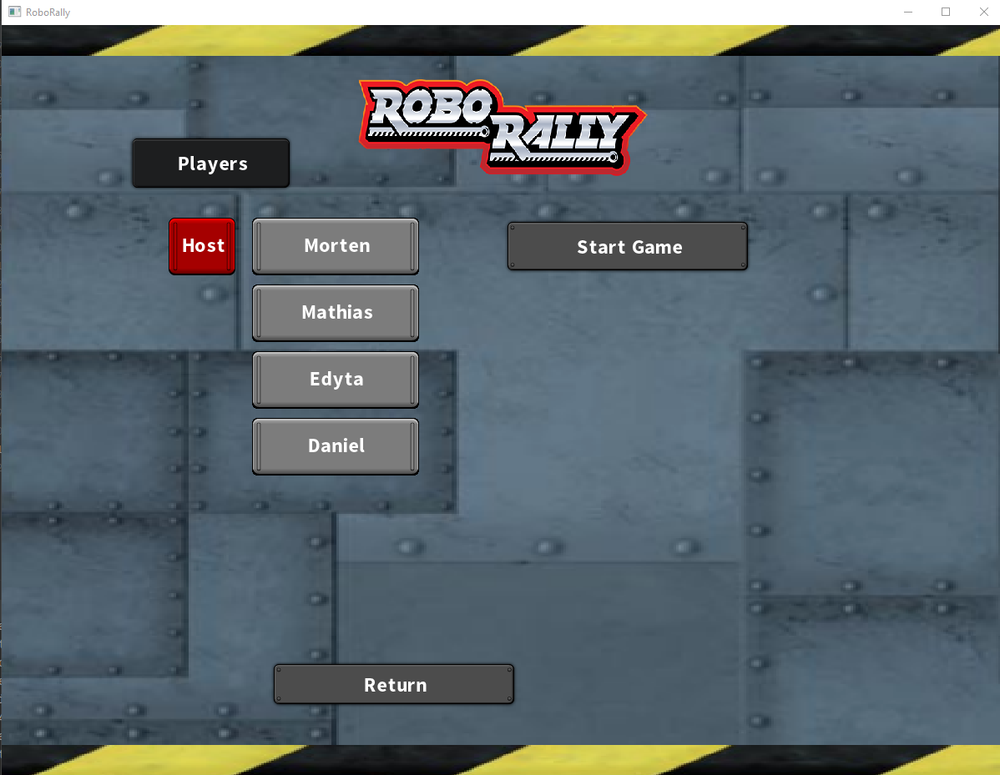
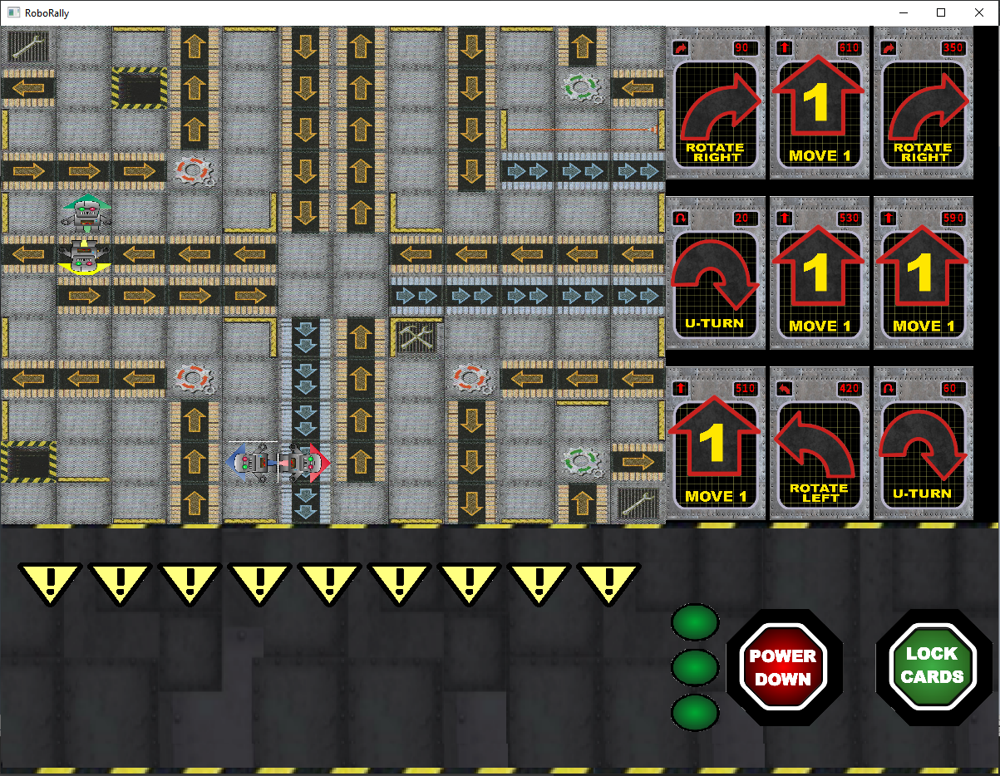
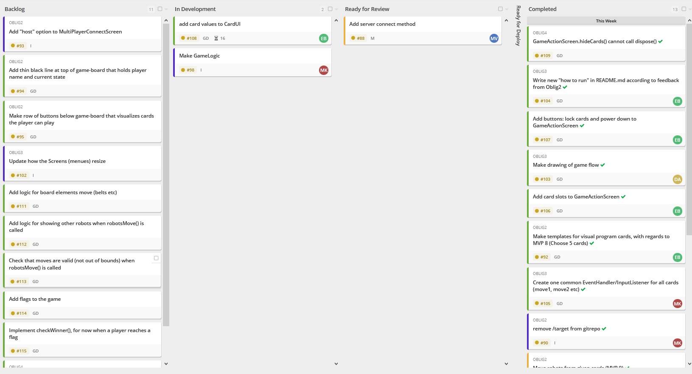
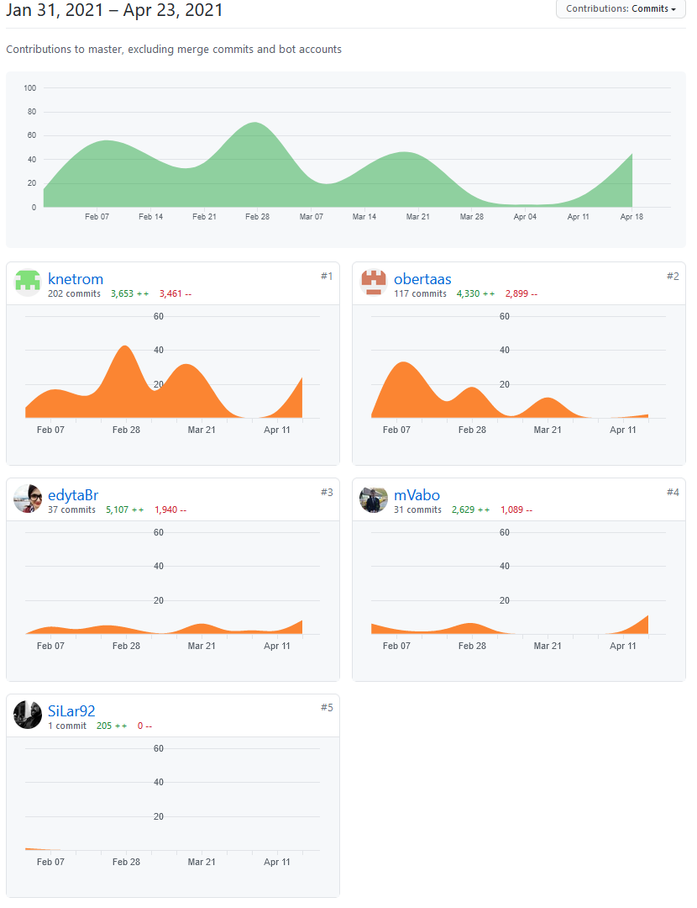
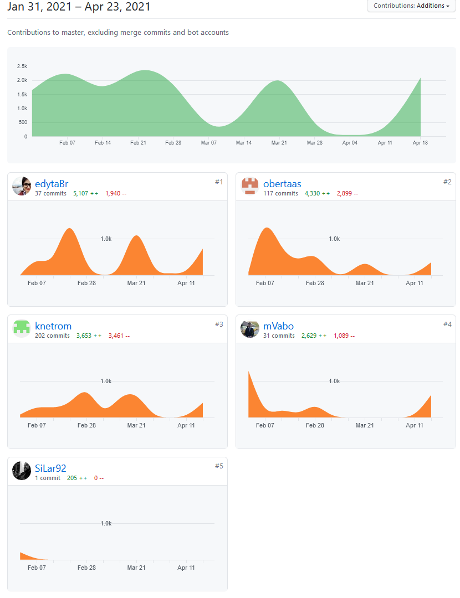
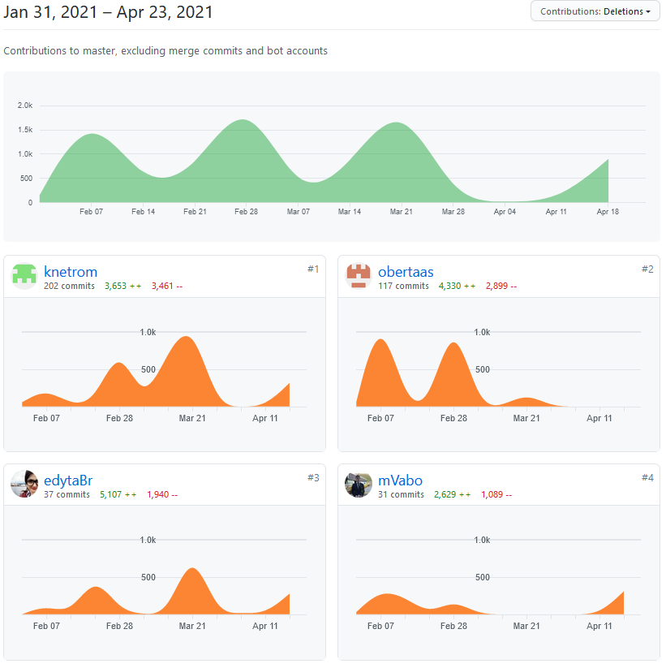

# Mandatory Assignment 4

Summary: This time we finished implementing MVP6 (multiplayer) across the internet. Although we were not able to fully
incorporate all game logic that we envisioned, all in all we are quite happy that we achieved a working server/client/
multiplayer incorporation of RoboRally.

#### Lobby for multiplayer

#### Multiplayer game

## Subproblem 1: Team and project
- No changes in the team roles, as they still work good.
- Retrospective:
  - Overall we find that the project could have gone better, but we are especially happy with the progress made the
    last couple of weeks regarding the server/client/multiplayer problems we faced along the course of this project.
  - One thing that we should have done differently is starting with the multiplayer part of the game, because this
  had such a great importance on the structure and flow/loop of the code
  - By starting with the multiplayer part, we would have had to make fewer changes to the base game.
    When the multiplayer was figured out and implemented, the base game was not able to handle the extra players
    the way we had planned.
  - We should have arranged more physical meetings as we saw that the one time that we actually did meet up in person,
    we made great progress in understanding the game concepts etc. We would have done this, if not for the ongoing
    pandemic restrictions.
  - Perhaps we should have asked for help earlier on to get a better starting point especially when it comes to the
    server/client and multiplayer aspect
  - To mention things that we are happy with: we have a game that works, all MVPs are covered except MVP 5 (Player wins
    by touching flag). This was already fulfilled prior to multiplayer implementation, however, somewhere during the
    multiplayer struggle we degraded the importance of that MVP.
  -   
  - An observation from those of us that have worked as engineers in other disciplines: This semester we have had a lot
    of work in other subjects, which makes us jump from project to project (and team to team). This is a usual way of
    doing things in real life, at least in the oil service industry where Morten has worked for a decade, and is the
    OPPOSITE of what XP, Kanban and Scrum is intended to achieve. These are some learning points for future projects:
    Simplify and reduce tasks to basic. Finish a task or a project before jumping to the next one.
- The group dynamic was still working nicely during this last leg of the programming tour; there has been no conflicts
  or lack of respect towards each other in any way.

### Links to minutes of meeting since last time
- Most of the work this leg has been done in a more ad-hoc approach, due to the clarity of what was actually needed
  to finish the project. For this reason, we held only one official meeting.
  [2021.4.19](moms/mom_2021_04_19.md)
  
### Project board screen shot

## Subproblem 2: Requirements

### MVP 6: Play from several computers (show and move pieces for all players)
#### Assumptions:
- One player can create an online RoboGame and that player's computer will act as the server, to which other players'
  computers can connect.
- The moves will be calculated locally at all instances of RoboRally (the server will not pass out the results, instead
  the server will provide all variables to the clients)

#### User stories:
- As a player I would like to connect to other RoboRally roboGame instances via the Internet to be able to play with
  other people
- As a player I would like to play online to play with my friends
- As a player I would like to play RoboRally online to be able to play with real people

#### Acceptance criteria:
- Given a locally running RoboRally instance
  with one other RoboRally instance connected via the Internet
  when a robot is moved at the _local_ RoboRally instance
  then the robot is moved accordingly at the _remote_ RoboRally instance

- Given a locally running RoboRally instance
  with one other RoboRally instance connected via the Internet
  when a robot is moved at the _remote_ RoboRally instance
  then the robot is moved accordingly at the _local_ RoboRally instance

- Given a running RoboRally instance,
  when the user sets up an online roboGame via the menu
  then that user's RoboRally instance accepts remote connections from other RoboRally instances

- Given a running RoboRally instance,
  when the user inputs a remote IP to connect to,
  AND that IP is used by a computer with a running RoboRally instance that accepts remote connections,
  then the local RoboRally instance can connect to the remote RoboRally instance.

#### Work tasks:
- Decide on a suitable library for online connections: used Kryonet
- Implement a `Server` or `Master` class (for the instance acting as the server):
  was implemented as `RoboRallyServer`
- Implement a `Client` or `Slave` class (for the instances connecting to the server):
  was implemented as `RoboRallyClient`
- Pass roboGame "facts" (like cards available, pieces picked, locations etc) from the server's `Game` to the clients'
  `Game` via the `Server`/`Client`classes
- Write tests for all functions: automatic tests for network and GUI have not been written, as we have not figured out
  how to achieve this
  
### Bugs
- There are guaranteed bugs that we don't know of, but more importantly there is a lack of functionality that prevents
  us to define this game as "completed"
- Power Down and Lock Cards buttons on a player's "program sheet" are at the moment not functional

## Subproblem 3: Product delivery and code quality
- The project should run at all operative systems as Linux, Windows, and OSX. However, for OSX there is a workaround.
  For instructions on how to build the project, see [README.md](../../README.md).
- The class diagram has not been updated with specific methods and field variables as suggested in last evaluation.
  This has not been prioritized due to late stage refactoring.
- Manual tests were made for Cards and multiplayer, see [ManualTest2.md](ManualTest2.md).

For an (unchanged) overview of classes and relationships,
see [class diagram](../ObligatoriskOppgave3/roborally_class_diagram_oblig3.pdf)

### Explanation of difference in number of commits
At first glance there is a big difference in the number of commits between the team members, even though it is less 
than for the previous assignment because we are further along in the project.
As last time, if one also looks at the number of lines changed, the difference is a lot less.

#### The main reasons for this are:
- Morten and Daniel have written most of the MOMs and other text files, this gives more commits
- Edyta and Mathias has written bigger chunks of code that has been waiting for earlier code to be finished,
  and their big changes were commited at once, giving fewer commits.
- Morten has refactored several files, changed data type for a lot of field variables and has removed
  unused code. Each file should have a separate commit, giving more commits
- Morten has "hosted" pair programming sessions, giving more commits
- Mathias' "legendary" online section of the code is finally pushed and implemented, giving a rise to his number of 
  commits.

Overall, everybody has contributed as evenly to the project as could be expected.

By looking at the number of lines added, removed, and the number of commits, the picture is more even.
as seen
in the below screenshots from Friday 23rd of April 2021.
#### Commits

#### Additions

#### Deletions

[Click here for live commit statistics](https://github.com/inf112-v21/Fantastic-Four/graphs/contributors)